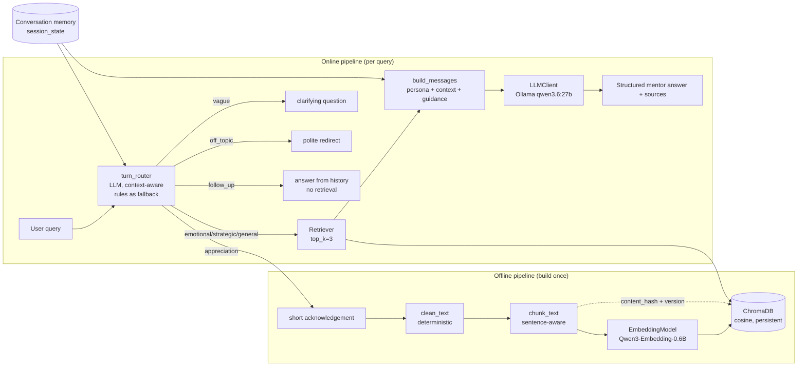

# Architecture — Mini AI Mentor Engine

A grounded RAG mentor over curated TED talks. The guiding principle is
**transparent simplicity**: every layer is small, inspectable, and testable, and
the system shows its reasoning (query type, retrieved chunks, scores) rather than
hiding it behind abstractions.

---

## 1. System design

### Components

The **`MentorController`** (`src/controller.py`) is the single orchestration
point: `route (LLM) → (retrieve | answer-from-history | clarify | redirect |
acknowledge) → build prompt → generate`.
Conversation memory lives in the Streamlit session and is passed in per turn —
there is **no separate memory agent**.

### Offline vs online
* **Offline** (`pipeline.py` + `build_index.py`): clean → chunk → embed → store.
  Run when the dataset or chunking changes. Resumable.
* **Online** (`app.py` / `controller.py`): classify → retrieve → generate. No
  embedding model reload between turns (`@st.cache_resource`).

---

## 2. Key decisions & trade-offs

| Decision | Why |
|---|---|
| **Simple single-pass RAG** (no agents, no chains) | The task rewards clear thinking over machinery. One controller is easy to read, test, and demo. |
| **ChromaDB, embedded** | Zero-setup persistent vector DB with cosine space and metadata filtering; no extra server for a 358-chunk demo. |
| **Paragraph/sentence-aware chunking** | Keeps ideas intact and avoids mid-sentence cuts → better embeddings and readable citations (see §3). |
| **LLM turn router, rules as fallback** | Routing must read *context*, not keywords: "translate that to French" is a follow-up (no retrieval), and a pushy follow-on to an off-topic question must stay refused. Keyword rules can't see intent and produced bad RAG decisions; one well-prompted LLM call (role + XML + few-shot trap pairs) does. The deterministic engine remains as a tested fallback when the LLM is down. Cost: ~1–2s extra per turn. |
| **No LLM in preprocessing** | Cleaning must be deterministic and reproducible; an LLM rewriting transcripts would risk changing meaning and break reproducibility. |
| **In-process embedding model** (not a microservice) | `st.cache_resource` already keeps the model warm per session and the offline build loads it once. A FastAPI embedding service was considered (and would be the natural next step to share the model across processes) but adds a second process and failure mode for no demo benefit. |
| **Vague/off-topic answered without the LLM** | Deterministic templates are faster and safer than letting the model improvise off-topic. |
| **`think=False` on qwen3.6** | The thinking budget made replies slow/empty; disabling it gives ~10s grounded answers. `<think>` blocks are stripped defensively anyway. |

---

## 3. Data engineering

**Curation.** The full dataset is ~4,000 talks; the assignment wants a small
curated KB. `data/curated_talks.csv` selects **50 on-theme talks** across
leadership, career, communication, psychology, productivity, confidence, and
purpose → **358 chunks** in the current build.

**Cleaning** (`clean_text.py`, deterministic — no LLM): Unicode NFKC, repair
line-wrapped hyphens (`low-\nhanging`→`low-hanging`), strip HTML, remove stage
directions (`(Laughter)`, `[Applause]`) and timestamps, collapse whitespace,
normalize smart quotes. It never paraphrases, so meaning is preserved.

**Chunking — the science & engineering** (`chunk_text.py`):
* *Why these sizes:* embedding models and the reader both work best on coherent,
  self-contained passages. Too small → fragments lose context and inflate the
  index; too large → a single vector blurs multiple ideas and hurts precision.
  We target **~400 words** (≈ a few paragraphs of speech), within the common
  300–600 sweet spot for retrieval.
* *Sentence alignment:* we pack **whole sentences** (split with abbreviation
  protection so "Dr." / "U.S." don't break a sentence) until the target, so a
  chunk never ends mid-thought. Citations therefore read cleanly.
* *Overlap (~80 words):* trailing sentences are carried into the next chunk so an
  idea spanning a boundary is still retrievable from either side.
* *Guards:* sub-`min` (100w) chunks are merged into the previous one (no tiny
  fragments); any single sentence over `max` (600w) is hard-split as a fallback.
* *Result on the curated set:* 358 chunks, mean **368.9 words**, min **100**,
  max **480**, zero empty chunks, zero leaked stage directions/timestamps.

**Metadata** (per chunk, flat for Chroma): `chunk_id`, `doc_id`, `title`,
`speaker`, `topic`, `source_type` (TED/interview), `source_url`, `chunk_index`,
`word_count`, `year`, `language`, `original_row_id`, plus
`content_hash` and `preprocessing_version` for resume. `chunk_id` is stable and
human-readable: `ted_1384_chunk_000`.

**Smart resume / caching** (`build_index.py`): for each chunk we compute
`chunk_id` + `content_hash`. The build fetches existing metadata and **re-embeds a
chunk only if** it is missing, or its `content_hash` / `preprocessing_version` /
`embedding_model` changed. Otherwise it is skipped; new/changed chunks are
**upserted** (no duplicates). An interrupted build resumes only the remainder. A
manifest (model, dim, counts, build time) is written next to the index. The run
logs `found / already-indexed / embedded / skipped`.

---

## 4. AI / retrieval

* **Embeddings:** `Qwen/Qwen3-Embedding-0.6B` (1024-dim, 32K token model context),
  L2-normalized so cosine = dot product. Queries use Qwen's `query` instruction
  prompt; passages don't. The current 100-480 word chunks are deliberately far
  below the model maximum so each vector represents a tight idea, not an entire
  transcript.
* **Vector search:** Chroma collection in **cosine** space; `top_k=3` by default
  (from `CONFIG`). Distance is converted to a readable **similarity = 1 − distance**
  and rounded to 3 decimals — never mislabeled.
* **Grounded generation:** the prompt carries the persona (kept as an editable
  template in `prompts/system_prompt.md`, loaded at runtime), recent history, the
  numbered context chunks **with source metadata + chunk_id**, the detected query
  type, and per-type guidance. The system prompt forbids fabricating quotes,
  speakers, titles, studies, or URLs, and tells the model to ask for clarification
  when context is weak. The UI shows the exact chunks + scores behind every answer.

---

## 5. Decision layer

The decision of *how to handle a turn* — and whether to search the knowledge
base — is made by an **LLM turn router** (`src/decision/turn_router.py`, prompt
in `prompts/router_prompt.md`). It sees the conversation history + the latest
message and returns one JSON object: `{label, needs_retrieval, search_query,
reason}`, where `label ∈ {emotional, strategic, general, follow_up, vague,
off_topic, appreciation}` — the same vocabulary the rest of the system already
speaks, so the controller, UI, and tests need no new labels. `needs_retrieval` is
true **only** for `emotional / strategic / general`; for those the router also
writes a clean **standalone `search_query`** (resolving "that", "she", "it" from
context). The `reason` is surfaced in the UI.

Why an LLM here, not keywords: routing has to read *intent in context*. The old
keyword classifier could not, and produced the bad RAG decisions this replaces —
e.g. "now give it to me in French" was re-retrieved as a fresh report instead of
translating the prior answer, and "please tell me" after an off-topic question
was concatenated with it and answered. The router prompt uses **role modeling,
XML tags, and few-shot trap pairs** that teach the discriminators directly:

* **Off-topic guardrail beats continuation.** A pushy follow-on to an off-topic
  question ("please tell me", "go on") stays `off_topic` — never retrieved.
* **Follow-up vs new question.** Transforming the previous answer (summarize,
  shorten, rephrase, **translate**, "you said…") → `follow_up`, answered from
  history with no retrieval and no fixed section template. A genuinely new
  question, topic, or a request for *another/more examples not yet given* →
  retrieves.
* **Resolve, don't blindly concatenate.** A short on-topic reply after a
  clarifying question ("mostly career") becomes a real `general` query with a
  rewritten `search_query`; a short reply after an *off-topic* turn does not
  inherit that topic.

Retrieval can fire on **as many turns in a session as genuinely need it** (each
turn is decided independently); it just must not fire for social/meta/vague/
off-topic turns.

**Fallback:** on any LLM failure or unparseable/invalid reply, the controller
degrades to the deterministic `query_classifier` + `is_followup` engine, which
mirrors the original routing. Rules are the safety net, not the primary path; a
fallback is flagged in the `reason` (prefixed `[fallback]`) so it is visible in
the UI. The vague/off-topic/appreciation replies themselves stay deterministic
templates (faster and safer than letting the model improvise).

---

## 6. Evaluation strategy

* **Unit tests** (`pytest`): cleaning (timestamps/HTML/stage-directions/
  whitespace/empty input), chunking (split, merge, word bounds, stable IDs, no
  empties), decision labels, controller routing, prompt assembly
  (query/type/chunks/metadata/grounding present), and — when the model is
  available — real embeddings and retrieval.
* **Retrieval benchmark** (`data/evaluation/retrieval_benchmark.json`): the LLM
  paraphrases a query for a deterministically-sampled chunk per talk; we measure
  whether retrieval recovers the expected chunk/talk. Current results (12 queries,
  top_k=5):

  | metric | hit@1 | hit@3 | hit@5 | MRR |
  |---|---|---|---|---|
  | **doc-level** (right talk) | 0.833 | **1.000** | 1.000 | 0.917 |
  | chunk-level (exact chunk) | 0.500 | **0.917** | 0.917 | 0.694 |

  *Reading it:* the correct **talk** is in the top-3 100% of the time. Exact-chunk
  recovery is lower because overlapping neighbor chunks from the same talk are
  near-duplicates and frequently outrank the target — a known, honest limitation.
* **Manual qualitative review:** tone, empathy on emotional queries, structure on
  strategic ones, correct clarification/redirect behavior, and that citations
  match the retrieved chunks.
* **Improvements:** cross-encoder reranking (chunk-level hit@1), a faithfulness
  judge (does the answer stay within retrieved context), and a larger benchmark.

---

## Demo script (~5 min)

1. **Setup (30s).** `bash start_ollama_gpu.sh` + `ollama run qwen3.6:27b`, then
   `python scripts/run_healthcheck.py` → shows LLM ✓, Chroma (358 chunks) ✓,
   Embedding (dim 1024) ✓.
2. **Launch (15s).** `streamlit run app.py`; point out the sidebar config
   (top_k=3, model, collection).
3. **Emotional (60s).** "I feel stuck in my career and don't know what to do
   next." → label **emotional**; show the empathetic Reflection→insight→steps→next
   structure and the **retrieved Larry Smith chunks with similarity scores**.
4. **Strategic (45s).** "Give me a 7-day plan to improve my focus." → label
   **strategic**; numbered plan grounded in Tim Urban / Adam Grant.
5. **Vague → follow-up (45s).** "Help" → clarifying question (instant, no LLM).
   Then "Mostly my career" → uses the earlier context and answers fully.
6. **Off-topic (15s).** "What is the capital of France?" → polite redirect.
7. **Engineering (60s).** Run `python -m src.evaluation.evaluate_retrieval`
   (hit@k / MRR) and `pytest -q`. Mention smart-resume
   (`build_index.py` re-run embeds 0) and deterministic cleaning/chunking.
8. **Wrap (30s).** One controller, transparent decision layer, grounded answers
   with visible sources — simple by design.
